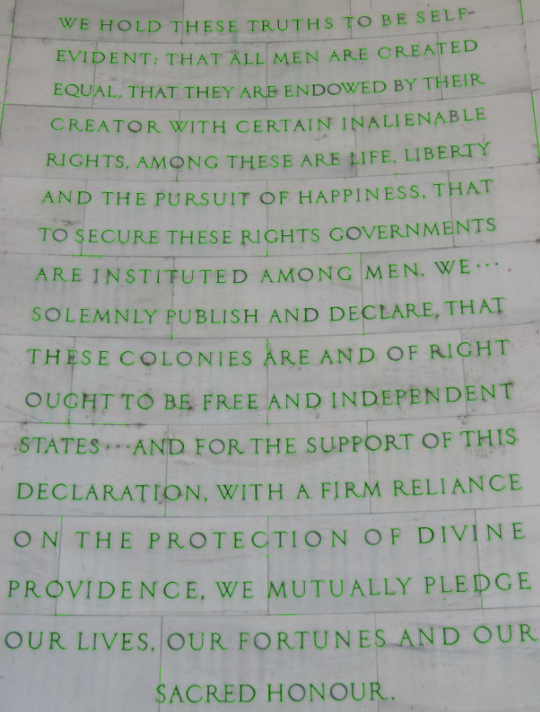

# Project 1: Edge detection
This project was developed as a solution to assignment 3 set by our teacher, Ross Deans Kristensens-McLachlan, during the course. A Github repository which contains all of the code in relation to my solution to the assignment can be found here: 
https://github.com/frillecode/VisualAnalytics2021/tree/main/src/project1

## Project description 
### Finding text using edge detection
The purpose of this assignment is to use computer vision to extract specific features from images. In particular, we're going to see if we can find text. We are not interested in finding whole words right now; we'll look at how to find whole words in a coming class. For now, we only want to find language-like objects, such as letters and punctuation.  

Data image:  
https://upload.wikimedia.org/wikipedia/commons/f/f4/%22We_Hold_These_Truths%22_at_Jefferson_Memorial_IMG_4729.JPG

Using the skills you have learned up to now, do the following tasks:
- Draw a green rectangular box to show a region of interest (ROI) around the main body of text in the middle of the image. Save this as image_with_ROI.jpg.  
- Crop the original image to create a new image containing only the ROI in the rectangle. Save this as image_cropped.jpg.
Using this cropped image, use Canny edge detection to 'find' every letter in the image  
- Draw a green contour around each letter in the cropped image. Save this as image_letters.jpg

The filenames of the saved images should clearly relate to the original image  

__Bonus challenges__  
If you want to push yourself, try to write a script which runs from the command line and which takes any similar input (an image containing text) and produce a similar output (a new image with contours drawn around every letter).


## Methods
To solve this assignment, I created a .py script which can be run from the command line. The script takes image data as input, performs preprocessing steps and Canny edge detection, and outputs three new versions of the image. First, a rectangular box is drawn around the region of interest (ROI) based on specified coordinates - as the ROI was not completely centered in the image, I played around to find the most appropriate coordinates. This image is saved as '{original\_image\_name}\_with\_ROI.jpg'. Then, the image is cropped according to these coordinates and saved as '{original\_image\_name}\_cropped.jpg'. The image is then converted to greyscale and blurred using a Gaussian blur to remove noise. Lastly, Canny edge detection is applied to extract text-like features from the image and draw green contours around letters. The final image is saved as '{original\_image\_name}\_letters.jpg'.  

## Usage
The structure of the repository belonging to this assignment is as follows:  
  - Data: _../../data/assignment3/_ 
  - Code: _edge\_detection.py_
  - Results: _out/_ 

### Cloning repo and installing dependencies 
To run the script, I recommend cloning this repository and installing relevant dependencies in a virtual environment:  

```bash
$ git clone https://github.com/frillecode/VisualAnalytics2021
$ cd VisualAnalytics2021
$ bash ./create_venv.sh #use create_venv_win.sh for windows
```


If you run into issues with some libraries/modules not being installed correctly when creating the virtual environment, install these manually by running the following:  
```bash
$ cd VisualAnalytics2021
$ source cds-vis/bin/activate
$ pip install {module_name}
$ deactivate
```

### Running scripts
After updating the repo (see above), you can run the .py-files from the command-line by writing the following:
``` bash
$ cd VisualAnalytics2021
$ source cds-vis/bin/activate
$ cd src/project1
$ python3 edge_detection.py
```

This script was originally made for the image provided in the project description, however, it has been updated to take any image as input and produce a similar output (input image must be in data folder). By parsing arguments when running the script from the command line, it is possible to specify which image to analyse, the coordinates for the ROI, and the min/max thresholds for Canny edge detection. 

You can get more information on which optional arguments can be parsed by running:
``` bash
$ python3 edge_detection.py --help
```

## Discussion of results
The resulting output-files from running the script can be found in 'out/'. Here, you see the last output with the contours:

After some tweaking of different parameters, e.g. thresholds for Canny edge detection, it seems that this method was quite successful in terms of finding text-features using. Most letters have been captured by the contours along with most punctuation (commas, points, colon). There are still a few issues, however. For example, small parts of the cracks/lines between the tiles have been picked up by the edge detection. It seems that this is the case in places where the cracks are quite dark/thick and especially in places where a horizontal line meets a vertical line. This makes sense since Canny captures edges by determining places where the brightness of the image changes more drastically. This could be solved by setting a more tight threshold, however, this is a balance to consider since many of the letters are then not picked up. I found that the values used in the script yielded the best results - but it is possible to try out different values through the command-line.  

To make the script more generalizable to other image inputs, I tried different approaches for setting coordinates for the ROI. At first, I made the coordinates relative to the shape of the image so that the ROI would always be in the center of the image. However, I found that for the image used in the assignment, it yielded better results to specify exact coordinates. Also, making the ROI exactly in the center would not be generalizable to images where the text is located elsewhere. Therefore, I decided to go with a solution where you can specify the exact coordinates in the command-line so that the script is adaptable to new images with text located elsewhere. When an image is loaded, the script then checks the provided coordinates against the size of the image to ensure that the coordinates are not out of bounds. For further work, an optimal solution could be to use a text detection algorithm to localise where in the image the text is located (e.g. [EAST text detector](https://github.com/argman/EAST)). 