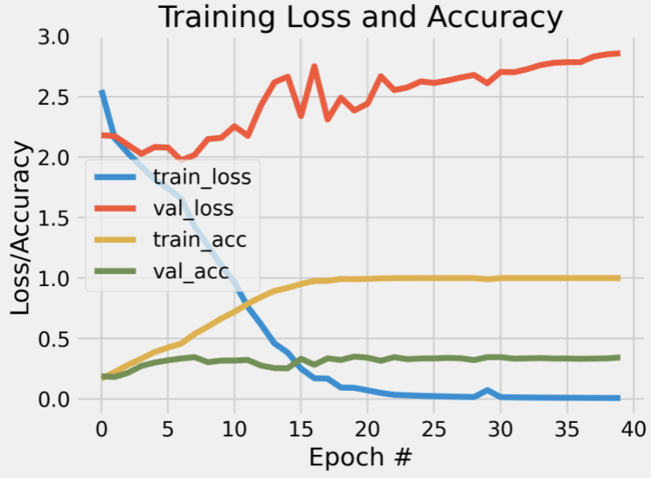

# Project 3: CNNs on cultural image data
This project was developed as a solution to assignment 5 set by our teacher, Ross Deans Kristensens-McLachlan, during the course. A Github repository which contains all of the code in relation to my solution to the assignment can be found here: 
https://github.com/frillecode/VisualAnalytics2021/tree/main/src/project3  

## Contribution
This project was completed in collaboration with Marie Damsgaard Mortensen who contributed with extracting the labels and setting up the structure of the CNN (50%). Turning our solutions into a .py-script and structuring of the repository was done individually. 

## Project description
### Multi-class classification of impressionist painters  
This week, your assignment is to use what you've learned so far to build a classifier which can predict artists from paintings.

You can find the data for the assignment here: https://www.kaggle.com/delayedkarma/impressionist-classifier-data

Using this data, you should build a deep learning model using convolutional neural networks which classify paintings by their respective artists. Why might we want to do this? Well, consider the scenario where we have found a new, never-before-seen painting which is claimed to be the artist Renoir. An accurate predictive model could be useful here for art historians and archivists!

Perhaps the most challenging aspect of this assignment will be to get all of the images into format that can be fed into the CNN model. All of the images are of different shapes and sizes, so the first task will be to resize the images to have them be a uniform (smaller) shape.

You'll also need to think about how to get the images into an array for the model and how to extract 'labels' from filenames for use in the classification report.  

You should save visualizations showing loss/accuracy of the model during training; you should also a save the output from the classification report


## Methods  
First, some preprocessing was done to get the image data into the correct format. For each image, the following steps were performed:  
1) load image
2) extract label for classification based on name of folder (corresponding to artist name)
3) resize image to ensure same size and shape across images (default 28x28 pixels)    

The data was already split up into test and train sets, and the preprocessing steps were performed on both data sets. After having extracted this information for all images, the data was transformed into a numpy array to feed into the CNN model. The data was normalized and the labels were binarized. This preprocessed data array was then fed to the CNN as the input layer. 

Based on this data, a deep learning model using convolutional neural networks (CNN) to classify the artists of the images was created. Using _tensorflow_ with _keras_, a sequential model with the following network architecture was defined:   

| Layer (type) | Output Shape  | Param # |
|---|---|---|
| conv2d (Conv2D) | (None, 200, 200, 32) | 896 |
| activation (Activation) | (None, 200, 200, 32) | 0 |
| flatten (Flatten) | (None, 1280000) | 0 |
| dense (Dense) | (None, 10) | 12800010 |
| activation_1 (Activation) | (None, 10) | 0 |  

_Total params: 12,800,906_  
_Trainable params: 12,800,906_  
_Non-trainable params: 0_  

First, we have a convolutional layer to deal with our 2D input and the output of this is fed forward through an activation layer using a "ReLU" activation function. Then, we add a flatten layer before continuing to the dense layer which produces our 10 output classes. This is fed forward to a "softmax" activation layer which makes the output sum to 1, thereby allowing us to interpret the output as probabilities for each class. 

The model was compiled using a stochastic gradient descent (SGD) optimizer and the loss-function "categorical_crossentropy". The model was then fit to the data and trained on 40 epochs with a batch size of 32. After running the script, a classification report and plot of the model as it learns can be found in the 'out'-folder. 

## Usage
The structure of the files belonging to this assignment is as follows:  
  - Data: File too big to push to github. Download [here](https://www.kaggle.com/delayedkarma/impressionist-classifier-data) and upload to _../../data/project3/_.
  - Code: _cnn-artists.py_  
  - Results: _out/_

### Cloning repo and installing dependencies 
To run the script, I recommend cloning this repository and installing relevant dependencies in a virtual ennvironment:

```bash
$ git clone https://github.com/frillecode/VisualAnalytics2021
$ cd VisualAnalytics2021
$ bash ./create_venv.sh #use create_venv_win.sh for windows
```
If you run into issues with some libraries/modules not being installed correctly when creating the virtual environment, install these manually by running the following:  
```bash
$ cd VisualAnalytics2021
$ source cds-vis/bin/activate
$ pip install {module_name}
$ deactivate
```

### Running script
After updating the repo (see above), you can run the .py-file from the command-line by writing the following:
``` bash
$ cd VisualAnalytics2021
$ source cds-vis/bin/activate
$ cd src/project3
$ python3 cnn-artists.py
```

The script takes different optional arguments that can be specified in the command-line. This allows you to specify the number of epochs, the number of neurons in the hidden layer, and the pixel values for resizing images. For example, to run the script with 20 epochs, 16 neurons in the hidden layer, and a resizing of images to 28x28 pixels, write:
```bash
$ python3 cnn-artists.py -r 28 -n 16 -e 20
```

You can get more information on the arguments that can be parsed by running:
``` bash
$ python3 cnn-artists.py --help
```

## Discussion of results  
The resulting output-files from running the script can be found in 'out/'. Here, you see the learning curves from running the script with 40 epochs and a batch size of 32:   
<p align="center">
    
  <p>  
   
The CNN model had a weighted average accuracy of 34% with f1-scores varying from 0.22 to 0.49 between the respective artists. These results suggest that the model was not successful in classifying paintings by their artists. Looking at the learning curves (see figure above), we see that the training loss decreases quite rapidly and hits 0 after 23 epochs, whereas the validation loss fluctuates and increases after approximately 6 epochs. The training accuracy increases until 15 epochs whereafter it plateaus. The training and validation accuracy diverges after approximtely 5 epochs with the validation accuracy not increasing thereafter. This suggests that the model might suffer from overfitting and that it does not generalize very well.     
