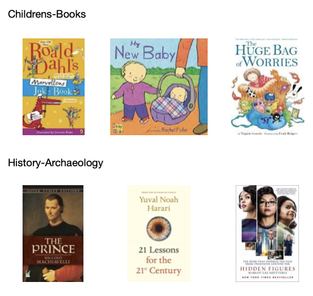
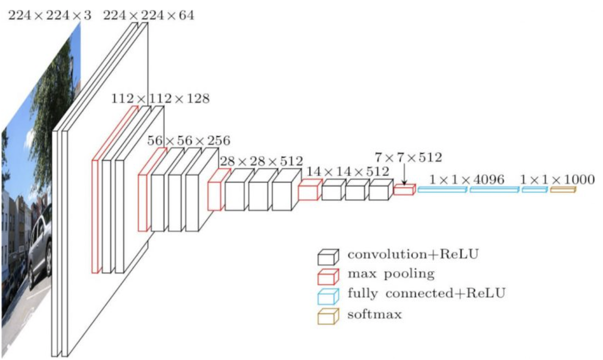
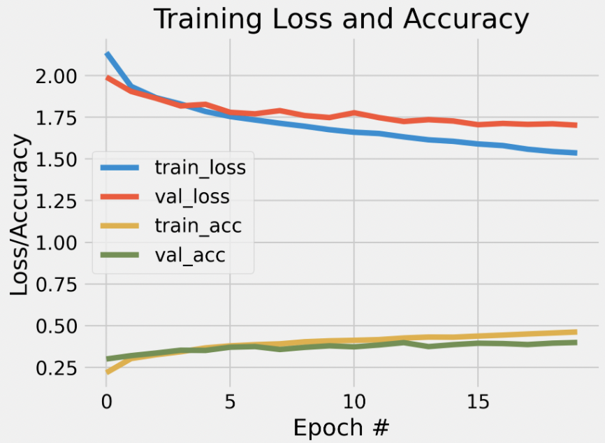
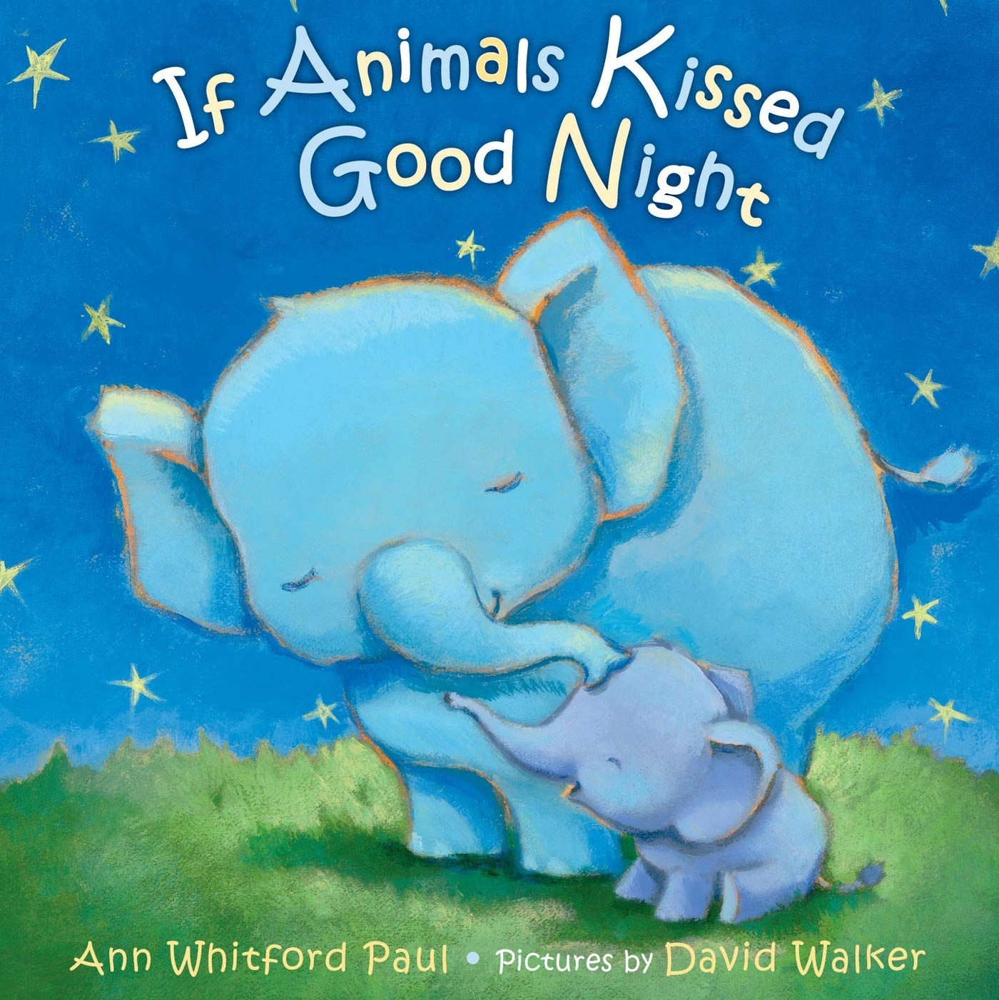

# Project 4: Don't judge a book by its cover
This is a self-assigned project. A Github repository which contains all of the code in relation to my solution to the project can be found here: 
https://github.com/frillecode/VisualAnalytics2021/tree/main/src/project4 

## Project description
__Classifying genres from books covers__

The cover of a book often provides the first impression on potential readers and the visual clues communicate information about the content of the book. In this project, I want to investigate whether it is possible to classify the genre of a book based on the cover using a deep learning CNN model. In addition, I want to see whether it is possible to use this model to predict the genre of a new, unseen book cover. Classifying books from their covers may tell us something about how representative a cover is of its genre, and the results might provide implications relevant to the development of book retrieval systems and digitized archives.

For this project, I have used a dataset which consists of image files of book covers scraped from [Book Depository](https://www.bookdepository.com/) divided into different genres. The dataset can be downloaded here: https://www.kaggle.com/lukaanicin/book-covers-dataset?select=book-covers.  

An example of book covers from different genres:



## Methods
The dataset has 33 different genres. For simplicity, I chose 10 genres to use in this project. The folders of theses genres are automatically extracted in the script. Each genre consists of close to 1000 images.

First, some preprocessing was done to get the image data into the correct format. For each image, the following steps were performed:  
1) load image
2) append label for classification based on name of folder (corresponding to genre)
3) resize image to 224x224 pixels (as this is the image size the VGG-16 model was trained on) 
4) transform data to numpy array
5) binarize label

A deep learning model using convolutional neural networks (CNN) to classify the genre of the book covers was created using _tensorflow_ with _keras_. I used a pretrained model from [VGG-16](https://keras.io/api/applications/vgg/) trained on the [ImageNet](https://image-net.org/) data set. The architecture of the VGG-16 model is depicted below: 
  
*Image borrowed from: https://neurohive.io/en/popular-networks/vgg16/*. 

The data is passed through a series of convolutional layers along with five max-pooling layers. A flatten layer is added followed by fully-connected classification layers (first with a "ReLU"-activation function, second with a "softmax" activation layer). To reduce overfitting, a dropout layer with a dropout rate of 20% was added. Thus, we ended up with the following network architecture: 

Layer (type) | Output Shape | Param # |
|---|---|---|
input_1 (InputLayer) | [(None, 96, 96, 3)] | 0 |
block1_conv1 (Conv2D) | (None, 96, 96, 64) | 1792 |
block1_conv2 (Conv2D) | (None, 96, 96, 64) | 36928 |
block1_pool (MaxPooling2D) | (None, 48, 48, 64)|  0 |
block2_conv1 (Conv2D) | (None, 48, 48, 128) | 73856 |
block2_conv2 (Conv2D) | (None, 48, 48, 128) | 147584 |
block2_pool (MaxPooling2D) | (None, 24, 24, 128) | 0 |
block3_conv1 (Conv2D) | (None, 24, 24, 256) | 295168 |
block3_conv2 (Conv2D) | (None, 24, 24, 256) | 590080 |
block3_conv3 (Conv2D) | (None, 24, 24, 256) | 590080 |
block3_pool (MaxPooling2D) | (None, 12, 12, 256) | 0 |
block4_conv1 (Conv2D) | (None, 12, 12, 512) | 1180160 |
block4_conv2 (Conv2D) | (None, 12, 12, 512) | 2359808 |
block4_conv3 (Conv2D) | (None, 12, 12, 512) | 2359808 |
block4_pool (MaxPooling2D) | (None, 6, 6, 512) | 0 |
block5_conv1 (Conv2D) | (None, 6, 6, 512) | 2359808 |
block5_conv2 (Conv2D) | (None, 6, 6, 512) | 2359808 |
block5_conv3 (Conv2D) | (None, 6, 6, 512) | 2359808 |
block5_pool (MaxPooling2D) | (None, 3, 3, 512) | 0 |
global_average_pooling2d (Gl | (None, 512) | 0 |
flatten (Flatten) | (None, 512) | 0 |
dense (Dense) | (None, 256) | 131328 |
dropout (Dropout) | (None, 256) | 0 |
dense_1 (Dense) | (None, 12) | 3084 |  

_Total params: 14,848,586_  
_Trainable params: 133,898_  
_Non-trainable params: 14,714,688_  

The model was compiled using an _Adam_-optimizer and the loss-function "categorical_crossentropy". The model was then fit to the data and trained on 20 epochs with a batch size of 128. After running the script, a classification report and plot of the model as it learns can be found in the 'out'-folder. If a new image to predict is specified in the command-line, the predictions of this will be printed. 


## Usage
The structure of the files belonging to this assignment is as follows:  
  - Data: File too big to push to github. Download [here](https://www.kaggle.com/lukaanicin/book-covers-dataset?select=book-covers ) and upload to _../../data/final_project/_.
  - Code: _book_covers.py_  
  - Results: _out/_

### Cloning repo and installing dependencies 
To run the script, I recommend cloning this repository and installing relevant dependencies in a virtual ennvironment:

```bash
$ git clone https://github.com/frillecode/VisualAnalytics2021.git
$ cd VisualAnalytics2021
$ bash ./create_venv.sh
```
If you run into issues with some libraries/modules not being installed correctly when creating the virtual environment, install these manually by running the following:  
```bash
$ cd VisualAnalytics2021
$ source cds-vis/bin/activate
$ pip install {module_name}
$ deactivate
```

### Running script
After updating the repo (see above), you can run the .py-file from the command-line by writing the following:
``` bash
$ cd VisualAnalytics2021
$ source cds-vis/bin/activate
$ cd src/project4
$ python3 book_covers.py
```

The script takes different optional arguments that can be specified in the command-line. This allows you to specify the number of epochs and the batch size for fitting the model. For example, to run the script with 20 epochs and a batch size of 128, you can write: 
```bash
$ python3 book_covers.py -e 20 -bs 128
```
In addition, you can specify a new image for the model to classify. To do this, you can use the image I provide (or upload your own image) in the '../..data/project4/unseen_images/'-folder and specify the filename in the command-line. E.g.:
```bash
$ python3 book_covers.py -ui "animal_book.jpeg"
```

You can get more information on the arguments that can be parsed by running:
``` bash
$ python3 book_covers.py --help
```


## Discussion of results   
The resulting output-files from running the script can be found in 'out/'. Running a model with a fully-connected classification layer at the end of a pretrained CNN (VGG-16) resulted in a weighted average accuracy score of 40%. Here, you see the learning curves from running the model with 20 epochs and a batch size of 128:
 


It seems that the model is slowly learning with the training and validation loss decreasing and the training and validation accuracy slowly increasing as more epochs are being run. This suggest that the model has not finished learning and might benefit from more data and training time. However, using a higher number of epochs comes with the risk of overfitting. Though the training and validation curves are relatively close together, it also seems that the validation and training loss are slowly starting to diverge as the number of epochs increase, suggesting a slight overfit. Therefore, acquiring more data might be the optimal solution. After tweaking different parameters such as learning rate and number epochs, this seemed to be the best balance I could find between over- and underfitting under the computational constraints of this project. 

To test the model on a new, unseen image, I downloaded a book cover of a childrens-book which was not in the original dataset: 
*Source: [Amazon](https://www.amazon.com/If-Animals-Kissed-Good-Night/dp/0374300216?ref_=Oct_s9_apbd_obs_hd_bw_blq&pf_rd_r=80T26NGDQ9FJ1SXAB4VN&pf_rd_p=4bc9607f-0546-55f9-85d5-8de6d48b6e00&pf_rd_s=merchandised-search-10&pf_rd_t=BROWSE&pf_rd_i=2966)*

This yielded the following probabilites for each of the classes:

Class (genre) | | 
|---|---|
Business-Finance-Law | 0.0 | 
Childrens-Books | 1.0 |
Crime-Thriller | 0.0 |
Dictionaries-Languages | |
Food-Drink | |
History-Archaeology | |
Medical | |
Romance | |
Science-Fiction-Fantasy-Horror | |
Teen-Young-Adult | |

  
Besides computational constraints when fitting the model, there are a few general issues to consider when attempting to classify genres based on book covers. First of all, covers can be ambiguous and one book may have different covers depending on the publisher. Secondly, genres can be overarching. Because this dataset has been scraped from the assigned genres of the website, there is some overlap. For example, the book "Harry Potter and the Cursed Child" is present in both _Childrens-Books_, _Science-Fiction-Fantasy-Horror_, and _Teen-Young-Adult_. In addition, the VGG-16 model has been trained on images, whereas many book covers are illustrations. These issues might explain parts of the difficulties of the model in predicting the genres based on covers.   

As there might be a natural limit as to how much the model can extract about genres from the covers, interesting future work could be to combine this with an analysis of the titles of the books.
